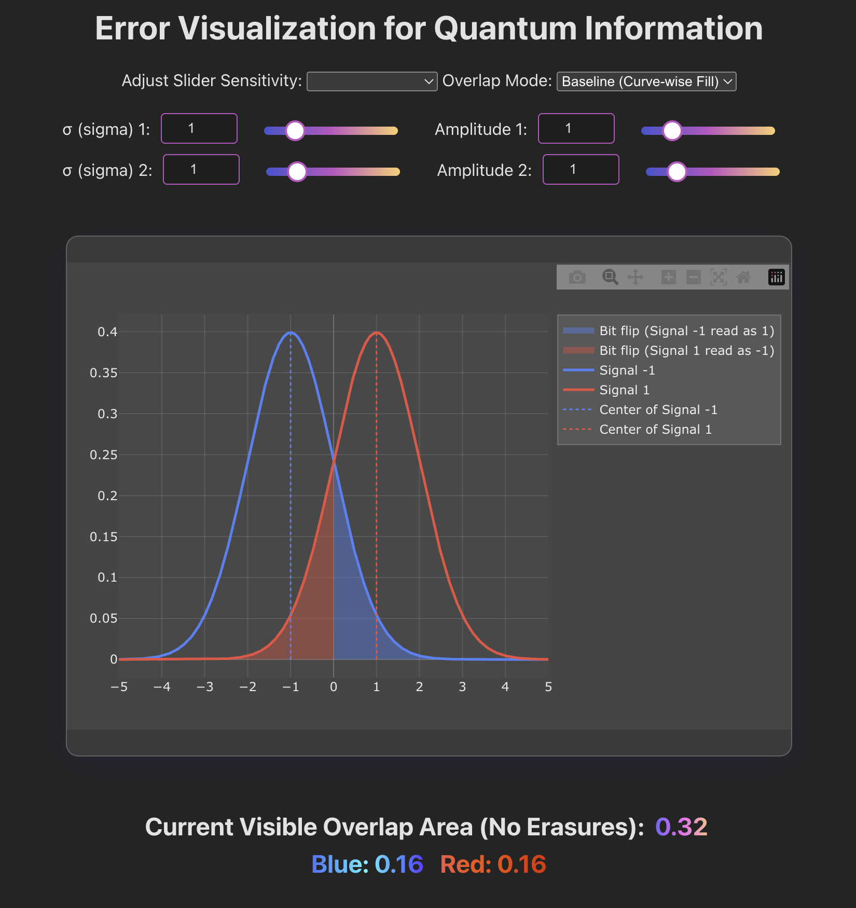

# Error Visualization for Quantum Information



This project provides an interactive visualization of error analysis in a quantum communication system. It models the probability density functions (PDFs) of two Gaussian-distributed signals (representing logical -1 and 1), computes the overlap area between them, and estimates error probabilities (bit flips) and erasure probabilities based on a configurable threshold.

---

## 🔍 Features

- **Interactive Gaussian Curves**  
  Visualize two Gaussian PDFs corresponding to logical -1 and 1 signals.

- **Adjustable Parameters**  
  - **σ (sigma)** and **amplitude** for each Gaussian curve  
  - **Threshold (τ)** separating decision regions

- **Visualization Modes**  
  - **Baseline Mode**: Colors overlapping area based on dominant curve  
  - **Total Overlap Mode**: Highlights the entire overlapping region  
  - **Left/Right Modes**: Emphasize error regions not affected by erasure as determined by threshold

- **Error Analysis**  
  - **Bit Flip Probability** $P_e$: Integral beyond threshold  
  - **Erasure Probability** $P_c$: Integral within threshold bounds

- **Trackpad Navigation**  
  - **Zoom**: Ctrl/Cmd + scroll or pinch  
  - **Pan**: Horizontal scrolling  
  - **Adjust Sensitivity**: Slider sensitivity can be changed via dropdown

---

## 🧮 Mathematical Description

### 1. Gaussian Probability Density Functions

For the two signals, the Gaussian PDFs are defined as:

$$
f_1(x) = A_1 \cdot \frac{1}{\sqrt{2\pi} \sigma_1} \exp\left(-\frac{(x - \mu_1)^2}{2\sigma_1^2}\right)
$$

$$
f_2(x) = A_2 \cdot \frac{1}{\sqrt{2\pi} \sigma_2} \exp\left(-\frac{(x - \mu_2)^2}{2\sigma_2^2}\right)
$$

Where:

- $A_1, A_2$ — amplitudes  
- $\sigma_1, \sigma_2$ — standard deviations  
- $\mu_1 = -1$, $\mu_2 = 1$ — means (fixed)

---

### 2. Overlap Area

The overlap between two PDFs is defined as:

$$
\text{Overlap Area} = \int_{-\infty}^{\infty} \min\left\{ f_1(x), f_2(x) \right\} \, dx
$$


This integral is numerically approximated using the trapezoidal rule.

---

### 3. Error and Erasure Probabilities

- **Bit Flip (Error) Probability** $P_e$:

$$
P_e = \int_{\tau}^{\infty} f_1(x) dx + \int_{-\infty}^{-\tau} f_2(x) dx
$$

- **Erasure Probability** $P_c$:

$$
P_c = \int_{-\tau}^{\tau} f_1(x) dx + \int_{-\tau}^{\tau} f_2(x) dx
$$

---

### 4. Notation

| Symbol       | Description                                |
|--------------|--------------------------------------------|
| $x$          | Input variable                             |
| $f_1(x), f_2(x)$ | Gaussian PDFs for signals -1 and 1     |
| $\sigma_1, \sigma_2$ | Standard deviations                |
| $A_1, A_2$   | Amplitudes (scaling factors)               |
| $\mu_1, \mu_2$ | Means (fixed at -1 and 1)                |
| $\tau$       | Threshold for decision boundaries          |
| $P_e$        | Bit flip error probability                 |
| $P_c$        | Erasure probability                        |

---

## 🚀 Installation & Usage

### 1. Clone the repository

```bash
git clone https://your.repo.url.git
cd your-project-directory
```

### 2. Install dependencies

Make sure [Node.js](https://nodejs.org/) is installed, then run:

```bash
npm install
```

### 3. Run the development server

```bash
npm run dev
```

Then open your browser and navigate to:

```
http://localhost:5000
```

---

## 🧠 How It Works (High-Level Summary)

- The tool simulates two Gaussian-distributed signals.
- You can tune their variances and amplitudes.
- The system calculates where they overlap.
- It estimates:
  - When signals are misclassified ($P_e$),
  - When the system cannot confidently decide ($P_c$).
- You can explore this through different interactive visualization modes.

---

## 📘 License

MIT License

---

## 💬 Acknowledgments

Special thanks to Dr. Emina Soljanin and her research team.

---
